

# cPanel Redis Manager

**Production-ready Redis management for cPanel & WHM servers.**

[Website](https://cpanelredismanager.com) · [Documentation](https://cpanelredismanager.com/documentation.php) · [Purchase](https://customerpanel.ca/client/store/addons-license-script/redis-manager) · [Roadmap](ROADMAP.md)

---

## Overview

**cPanel Redis Manager** is a commercial plugin by [UnderHost](https://underhost.com) that brings fully managed Redis to cPanel and WHM environments.

It handles installation, configuration, process management, health monitoring, and per-account isolation - all through a native UI.

Designed for shared hosting environments, it allows each cPanel account to run its own Redis instance safely and predictably without requiring manual server administration.

---

## Key Capabilities

- **Per-account Redis instances** - fully isolated per cPanel user
- **One-click lifecycle management** (start, stop, restart)
- **Automatic port assignment** and secure AUTH key generation
- **WHM control panel** for server-wide monitoring and management
- **Per-account limits** (`maxmemory`, eviction policy, and more)
- **Health monitoring system** - detects broken or unresponsive instances
- **Automatic recovery via cron**
- **Backup and restore system** (per account)
- **Safe configuration system** - no dangerous directives allowed
- **CloudLinux & CageFS compatible**

---

## Designed for Hosting Environments

cPanel Redis Manager is built specifically for hosting providers:

- No shared Redis instance - **each account is isolated**
- No unsafe configuration exposure
- No manual CLI or root intervention required for daily use
- Predictable behavior across hundreds of accounts

---

## Supported Environments

cPanel Redis Manager follows the **official cPanel-supported operating system lifecycle** and remains compatible with all supported cPanel releases.

### Supported Operating Systems

| OS | Support Status |
|---|---|
| AlmaLinux 8 | Supported until March 1, 2029 |
| AlmaLinux 9 | Supported until May 31, 2032 |
| AlmaLinux 10 | Supported until May 31, 2035 |
| CloudLinux 8 | Supported until May 31, 2029 |
| CloudLinux 9 | Supported until May 31, 2032 |
| CloudLinux 10 | Supported until May 31, 2035 |
| Rocky Linux 8 | Supported until March 31, 2026 |
| Rocky Linux 9 | Supported until March 31, 2026 |
| Ubuntu 22.04 LTS | Supported until June 30, 2027 |
| Ubuntu 24.04 LTS | Supported until April 2029 |

### Legacy / Extended Support

| OS | Status |
|---|---|
| CentOS 7 / RHEL 7 / CloudLinux 6 | End of life (July 31, 2024) |
| CloudLinux 7 (ELS) | Critical updates until January 1, 2027 |
| CentOS 7 (ELS) | Critical updates until January 1, 2027 |
| Ubuntu 20.04 LTS | End of life (April 30, 2025) |

> ⚠️ Support for legacy systems is best-effort only. New features may not be backported.

---

## Current Status

| Version | Status |
|---|---|
| v2.0.3 | ✅ Current production version |
| v2.0.4 | 🧪 Early access (new installs & beta testers) |
| v2.1.x | 🔄 WHM plugin + security hardening (June 2026) |
| v2.2.x | ⚙️ Stability + per-account control (July-August 2026) |
| v2.3.x | 📦 Hosting features + reseller tools |

👉 See [ROADMAP.md](ROADMAP.md) for full details.

---

## Pricing

| License | Price | Scope |
|---|---|---|
| Single-Server | **$29.95 USD** one-time | One server, unlimited Redis instances |

- Free lifetime updates included
- IP can be changed if you migrate servers
- Early adopters retain lifetime access to all updates

[→ Purchase a license](https://customerpanel.ca/client/store/addons-license-script/redis-manager)

---

## Installation

Installation requires a valid license.

The installer handles:
- Redis installation
- cPanel plugin deployment
- Automatic configuration
- Service setup (cron / systemd)

> ⚠️ The installation package is distributed privately to licensed users.

---

## Documentation

Full documentation:

👉 https://cpanelredismanager.com/documentation.php

Includes:
- Installation and setup
- Configuration reference
- CloudLinux / CageFS integration
- Redis PHP extension setup

---

---

## Screenshots

### cPanel Interface

  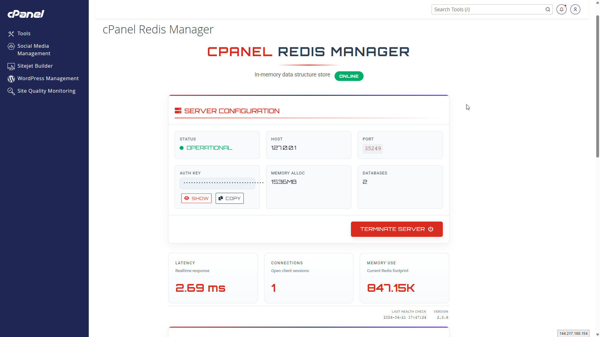
  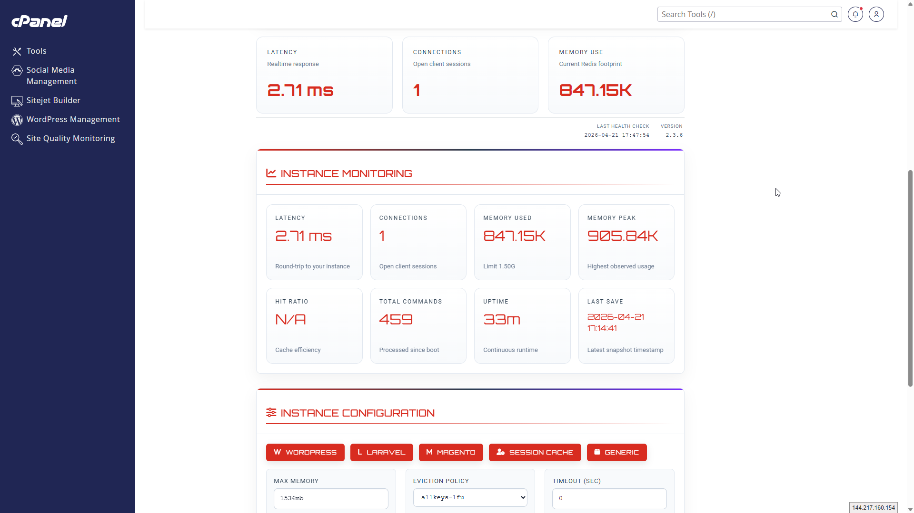
  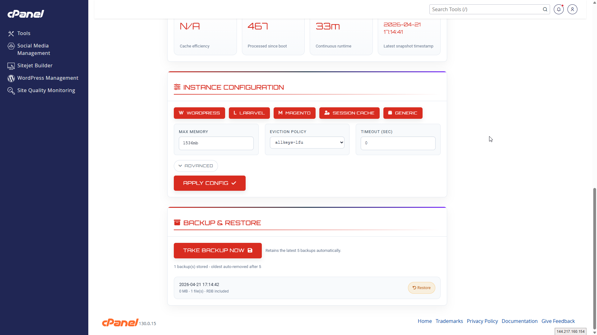

  <em>Per-account Redis management directly inside cPanel</em>

---

### WHM Interface

  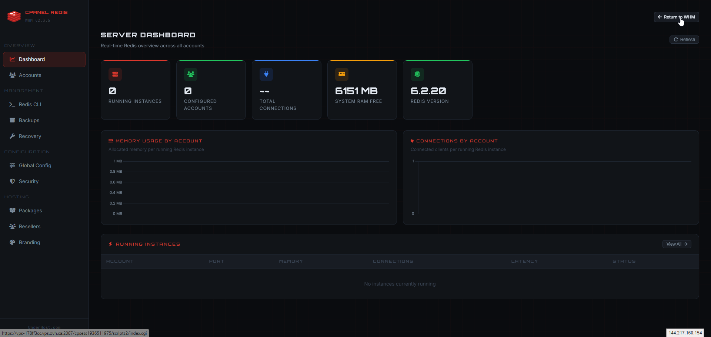
  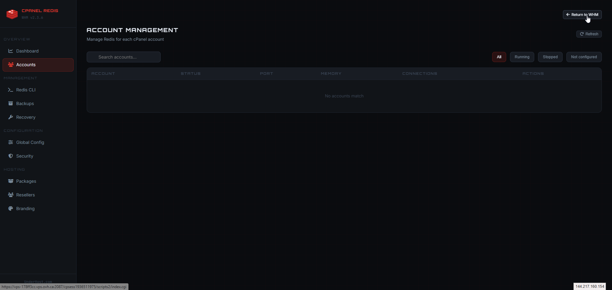
  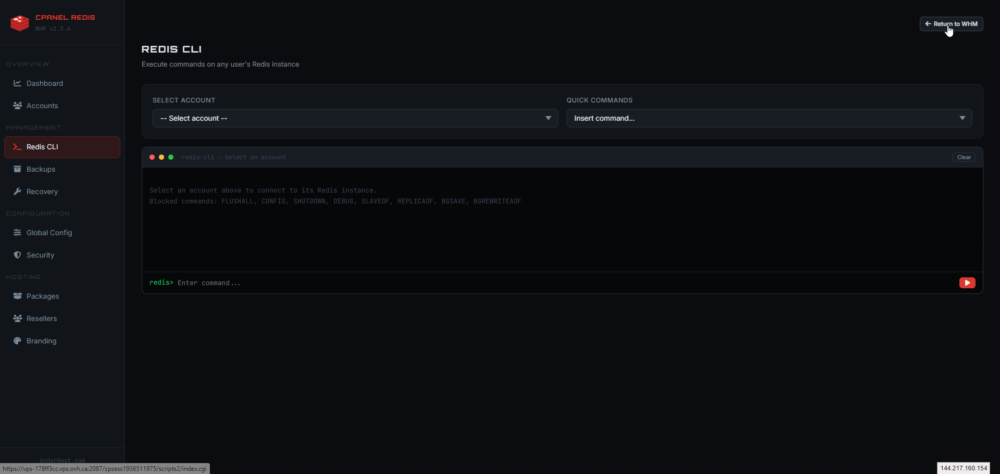

  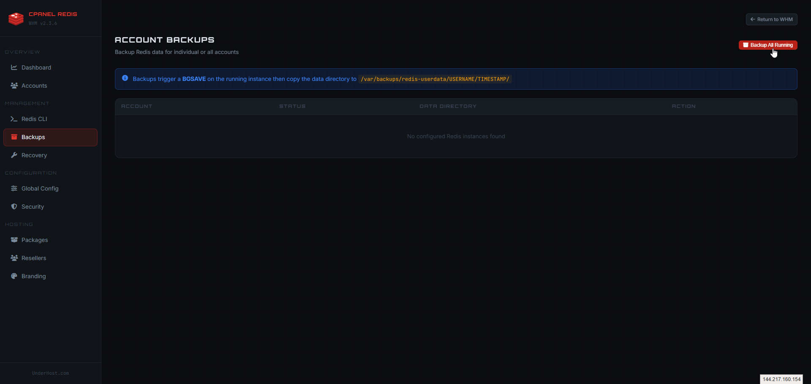
  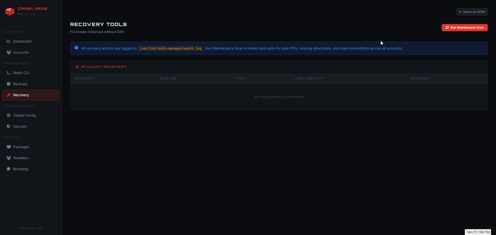
  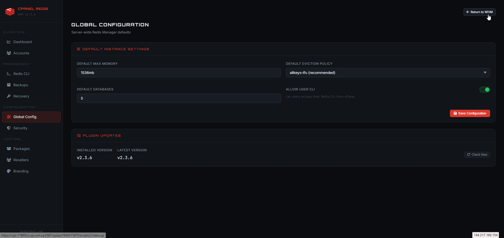

  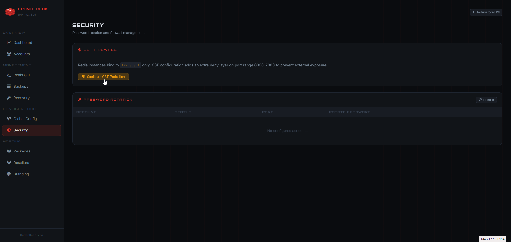
  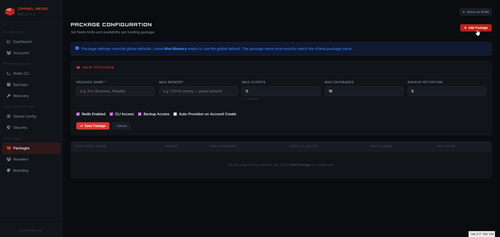
  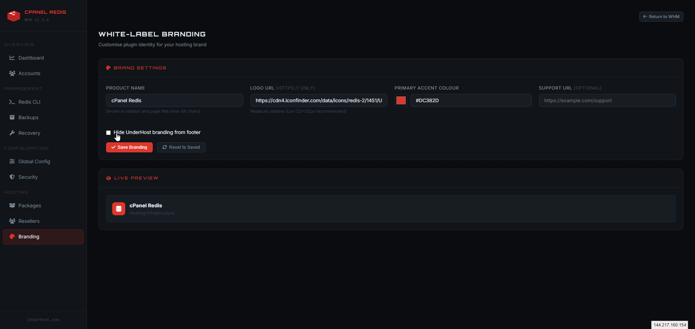

  <em>Full WHM control panel with monitoring, limits, and management</em>

---

## About This Repository

This repository is the **public documentation and product information hub**.

The plugin source code is **proprietary** and not publicly distributed.

This repo exists to:
- Publish roadmap and product updates
- Provide compatibility and usage documentation
- Support users and customers

---

## Legal

cPanel® is a registered trademark of cPanel, L.L.C.  
This project is not affiliated with or endorsed by cPanel, L.L.C.

© 2026 UnderHost.com. All rights reserved.
